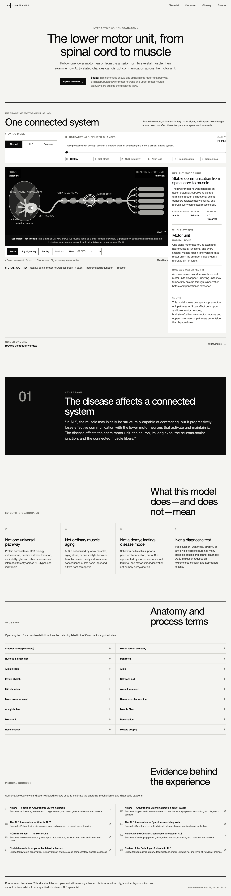

# Lower Motor Unit — Healthy Signaling and ALS

A responsive, backend-free educational illustration that uses a lightweight Three.js scene to explain the complete lower motor unit and selected ALS-related changes. It is schematic and not to scale; it is not medical advice, not a diagnostic tool, and not treatment guidance. The application is packaged as a Next.js App Router project for Vercel and includes an automatic Canvas fallback when WebGL is unavailable.



## Run locally

Requirements: Node.js 22.13 or newer.

```bash
npm ci
npm run dev
```

Open `http://localhost:3000/`.

For a production check:

```bash
npm test
npx playwright install chromium
npm run test:browser
npm start
```

The browser suite installs Chromium separately with
`npx playwright install chromium`. To demo the deterministic accessible view,
open `http://localhost:3000/?fallback=1`; normal WebGL-capable browsers use the
interactive 3D scene by default.

No backend, account, database, worker, cloud binding, or environment variable is
required. Legacy authentication, D1, Drizzle, Cloudflare Worker, Vite, and
Vinext template code has been removed from the release branch because none of
it was reachable from this educational application.

## Interaction

- Land on the cinematic hero: a deterministic ~6-second ambient loop of the lower motor unit with Normal, ALS, and Compare modes, an illustrative-state slider, and chapter markers (Cell body, Axon, Junction, Muscle) that steer the camera; under `prefers-reduced-motion` the hero shows a static poster instead of animating.
- Follow the **Explore the full atlas** link down to the full interactive experience.
- Drag with a mouse or one finger to rotate the 3D motor unit.
- Scroll or pinch to zoom.
- Use the anatomical labels for guided camera views.
- Switch among Normal, ALS, and Side-by-side modes.
- Move the timeline from the healthy state through five illustrative ALS-related teaching states.
- Play, pause, replay, slow, or launch the guided Signal journey.
- Choose **Use simplified view** to preview the accessible 2D fallback.
- Press `R` while focus is outside a control to reset the camera.

## Project structure

- `app/page.tsx` — page composition, hero, educational copy, glossary, sources, and disclaimer
- `components/HeroSection.tsx` — full-viewport cinematic hero layout and controls
- `components/CinematicMotorUnitHero.tsx` — Three.js hero stage driven by the ambient loop
- `components/hero-types.ts` — shared prop types between the hero section and its renderer
- `lib/cinematic-loop.ts` — deterministic ~6-second hero loop (camera poses, pulse/cargo timing)
- `components/MotorUnitExperience.tsx` — modes, timeline, playback, camera, structure, and fallback controls
- `components/MotorUnitScene.tsx` — Three.js renderer, controls, and scene lifecycle for the atlas
- `components/motor-unit-model.ts` — procedural motor-neuron model builders (neuron, axon, cargo, terminals, junctions, muscle fibers) shared by hero and atlas
- `components/MotorUnitFallback.tsx` — responsive Canvas fallback
- `lib/content.ts` — medically important stage, structure, glossary, and source content
- `app/globals.css` — responsive visual system and accessibility states

## Deployment

Any platform that supports a standard Next.js production build can host the
site. Vercel detects the application without custom build commands. The
sanitized `.openai/hosting.json` file is retained only to document that the
previous project identifier and unused bindings were removed; it is excluded
from deployment and is not read by the application.

## Accessibility and performance

The interface uses semantic controls, visible focus styles, 44px-or-larger mobile targets, keyboard-operable labels, high-contrast palettes, live status text, and layouts that do not rely on horizontal scrolling. `prefers-reduced-motion` pauses the scene by default and makes camera changes immediate unless the user explicitly opts into playback.

The scene uses procedural low-polygon geometry, no texture downloads, lazy-loaded Three.js code, capped pixel density, steady 24/45 fps targets, fewer particles and geometry segments on constrained devices, offscreen rendering suspension, and complete WebGL cleanup. A responsive Canvas diagram preserves the content and stage controls when WebGL is unavailable.

## Scientific scope

The numbered ALS states are a teaching scaffold, not clinical stages and not one claimed molecular sequence. ALS can affect upper and lower motor neurons; this model focuses on lower motor neurons. It does not frame primary demyelination as the defining mechanism, distinguishes neurogenic atrophy from ordinary muscle aging, and does not treat any visible sign as diagnostic.

This visualization is an educational illustration, not medical advice, not a
diagnostic tool, and not treatment guidance. It is not a substitute for clinical
care. The schematic is not to scale, and its illustrative states are not
clinical stages or a patient timeline.

The evidence mapping and review limits are recorded in
[`docs/MEDICAL_REVIEW.md`](docs/MEDICAL_REVIEW.md). Asset provenance and release
rights are tracked separately in
[`THIRD_PARTY_RIGHTS.md`](THIRD_PARTY_RIGHTS.md).

## Portfolio case study

See [the case study and guided demo](docs/PORTFOLIO.md) for the software scope,
the related static implementation, and the distinction between this running
application and separately created animation videos. The
[media provenance record](docs/MEDIA_PROVENANCE.md) does not grant rights to
those external videos or select one for publication.

## License

Original application source is licensed under the [MIT License](LICENSE).
Owner-created educational prose, labels, diagrams, and screenshots identified
in [`THIRD_PARTY_RIGHTS.md`](THIRD_PARTY_RIGHTS.md) are separately licensed
under [CC BY 4.0](CONTENT_LICENSE.md). Third-party code and other material
retain their own notices and terms; the external animation files in the media
inventory are not included or relicensed.
