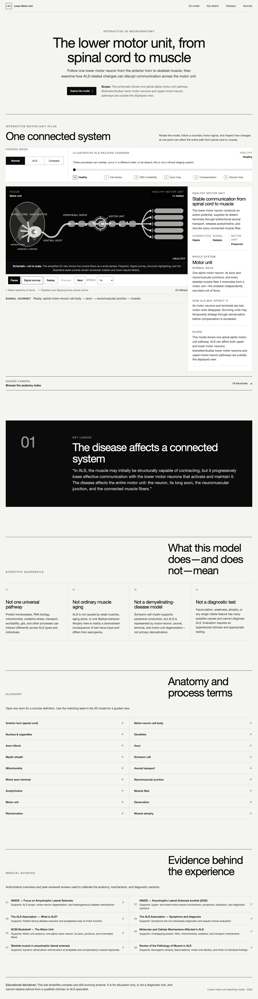

# Lower Motor Unit — Healthy Signaling and ALS

This project is a responsive educational illustration. It uses a lightweight
Three.js scene to explain the complete lower motor unit and selected changes
related to amyotrophic lateral sclerosis (ALS). It is schematic and not to scale.
It is not medical advice, not a diagnostic tool, and not treatment guidance.

The application is a Next.js App Router project, packaged for Vercel. It has no
backend. If WebGL is not available, the application automatically shows a
Canvas fallback.



## Medical disclaimer

This visualization is an educational illustration, not medical advice, not a
diagnostic tool, and not treatment guidance. It is not a substitute for clinical
care. The schematic is not to scale, and its illustrative states are not
clinical stages or a patient timeline.

## What the page shows

### Hero

The page opens on the cinematic hero. The hero is a deterministic ambient loop
of the lower motor unit. The loop lasts about 6 seconds. The hero has these
controls:

- Normal, ALS, and Compare modes.
- An illustrative-state slider.
- Chapter markers (Cell body, Axon, Junction, Muscle) that steer the camera.

If `prefers-reduced-motion` is on, the hero shows a static poster and does not
animate.

### Atlas

The **Explore the full atlas** link goes down to the atlas. The atlas is the
full interactive experience. In the atlas, you can do these actions:

- Drag with a mouse or one finger to rotate the 3D motor unit.
- Scroll or pinch to zoom.
- Use the anatomical labels for guided camera views.
- Switch among Normal, ALS, and Compare modes.
- Move the timeline from the healthy state through five illustrative ALS-related
  teaching states.
- Play, pause, replay, or slow the animation.
- Start the guided Signal journey.
- Choose **Use simplified 2D view** to preview the accessible Canvas fallback.
- If focus is outside a control, press `R` to reset the camera.

## Requirements

- Node.js 22.13 or newer.

The application does not need a backend, account, database, worker, cloud
binding, or environment variable.

The release branch does not contain the legacy authentication, D1, Drizzle,
Cloudflare Worker, Vite, and Vinext template code. This code was removed
because no part of this educational application could reach it.

## Run locally

1. Run these commands. They install the exact dependencies and start the
   development server.

   ```bash
   npm ci
   npm run dev
   ```

2. Open `http://localhost:3000/`.

To show the deterministic accessible Canvas fallback, open
`http://localhost:3000/?fallback=1`. By default, browsers that support WebGL
show the interactive 3D scene.

## Test and production check

Run these commands for a production check:

```bash
npm test
npx playwright install chromium
npm run test:browser
npm start
```

The browser suite needs Chromium. The `npx playwright install chromium` command
installs it separately.

## Project structure

- `app/page.tsx` — page composition, hero, educational copy, glossary, sources, and disclaimer
- `components/HeroSection.tsx` — full-viewport cinematic hero layout and controls
- `components/CinematicMotorUnitHero.tsx` — Three.js hero stage driven by the ambient loop
- `components/hero-types.ts` — shared prop types between the hero section and its renderer
- `lib/cinematic-loop.ts` — deterministic ~6-second hero loop (camera poses, pulse/cargo timing)
- `components/MotorUnitExperience.tsx` — modes, timeline, playback, camera, structure, and fallback controls
- `components/MotorUnitScene.tsx` — Three.js renderer, controls, and scene lifecycle for the atlas
- `components/motor-unit-model.ts` — procedural motor-neuron model builders (neuron, axon, cargo, terminals, junctions, muscle fibers) shared by hero and atlas
- `components/MotorUnitFallback.tsx` — responsive Canvas fallback
- `lib/content.ts` — medically important stage, structure, glossary, and source content
- `app/globals.css` — responsive visual system and accessibility states

## Accessibility and performance

The interface has these accessibility features:

- Semantic controls.
- Visible focus styles.
- Mobile targets of 44px or larger.
- Labels that you can operate with a keyboard.
- High-contrast palettes.
- Live status text.
- Layouts that do not rely on horizontal scrolling.

If `prefers-reduced-motion` is on and you do not explicitly opt into
playback, the scene pauses by default and camera changes are immediate.

The scene uses these performance measures:

- Procedural low-polygon geometry.
- No texture downloads.
- Lazy-loaded Three.js code.
- Capped pixel density.
- Steady 24/45 fps (frames per second) targets.
- Fewer particles and geometry segments on constrained devices.
- Suspended rendering when the scene is offscreen.
- Complete WebGL cleanup.

If WebGL is not available, the responsive Canvas fallback keeps the content and
the stage controls.

## Deployment

Any platform that supports a standard Next.js production build can host the
site. Vercel detects the application and does not need custom build commands.

The repository keeps the sanitized `.openai/hosting.json` file only as a
record. This file shows that the previous project identifier and the unused
bindings were removed. The deployment excludes this file, and the application
does not read it.

## Scientific scope

The numbered ALS states are a teaching scaffold. They are not clinical stages,
and they do not claim one molecular sequence.

ALS can affect upper and lower motor neurons. This model focuses on lower motor
neurons. The model:

- Does not frame primary demyelination as the defining mechanism.
- Distinguishes neurogenic atrophy from ordinary muscle aging.
- Does not treat any visible sign as diagnostic.

[`docs/MEDICAL_REVIEW.md`](docs/MEDICAL_REVIEW.md) records the evidence mapping
and the review limits. [`THIRD_PARTY_RIGHTS.md`](THIRD_PARTY_RIGHTS.md) records
the asset provenance and release rights separately.

## Portfolio case study

[The case study and guided demo](docs/PORTFOLIO.md) describe these items:

- The software scope.
- The related static implementation.
- The distinction between this running application and separately created
  animation videos.

The [media provenance record](docs/MEDIA_PROVENANCE.md) does not grant rights
to those external videos. It also does not select one of them for publication.

## License

Original application source is licensed under the [MIT License](LICENSE).
Owner-created educational prose, labels, diagrams, and screenshots identified
in [`THIRD_PARTY_RIGHTS.md`](THIRD_PARTY_RIGHTS.md) are separately licensed
under [CC BY 4.0](CONTENT_LICENSE.md). Third-party code and other material
retain their own notices and terms. The external animation files in the media
inventory are not included or relicensed.
